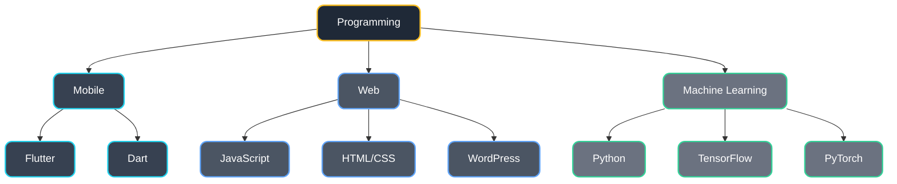
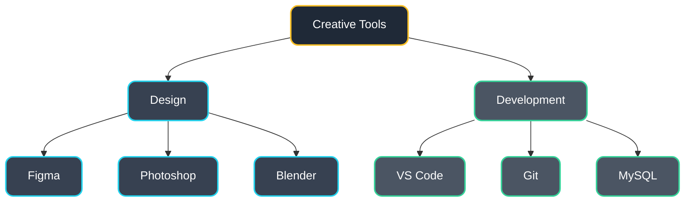

<h1 align="center">Hi, I'm Vishnu Prakash 👋</h1>
<h3 align="center">Native App | DevOps Enthusiast</h3>

<div align="center">

[](url)
[](https://www.linkedin.com/in/vishnupraksh/)
[](mailto:vishnuprakash572@gmail.com)
[](url)


</div>

```typescript
class Developer {
    name: string = "Vishnu Prakash";
    role: string = "(Flutter | React Native | NativeScript ) Developer";
    location: string = "India";
    workingOn: string = "AuxiFy";
    learning: string[] = ["Flutter", "React Native", "NativeScript", "DevOps"];
    askMeAbout: string[] = ["Web Dev", "App Dev", "DevOps", "Entrepreneur", "Taxation"];
}
```

## 💻 Technical Skills



## 🎨 Design & Tools



## 📊 GitHub Stats

<div align="center">
  <a href="https://git.io/streak-stats"></a>
  &nbsp;&nbsp;
  
</div>

## 🤝 Connect With Me

<div align="center">
    
[](https://www.linkedin.com/in/vishnupraksh)
[](https://www.instagram.com/_im_vishn_u/)


</div>


<div align="center">
  <i>Always learning, always growing. Feel free to reach out!</i>
</div>
